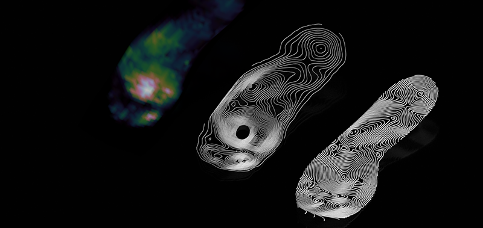

# Christine Marcelino's TDF GitHub Repository!
Welcome to my GitHub repository! 

--- 

# Weekly Report 4 - September 20, 2023 

**Summary**
This week I did not do much with my Photon device except the tutorials.

**Speculation**
**Reflection**

--- 

# Weekly Report 4 - September 20, 2023 

**Summary**

Boom! Project 1 done. I did all my weekly reflections which I didn't know we had to do, but it was great to reflect as a whole about this project and my experience. I hate to say it, but TDF my be one of my favorite classes so far. Im excited about the next project. I love stuff the gifts of potential we got this week. 

**Speculation**

I was so impresseds with my progress in this course and the conenctions I have been making to my own design interests that I decided to make a another repository to track my progress MDES. Unfortunately I am not able to make it work. (PS shm... please help!) I also learned how to make a folder. I am excited about the potential of the next project as well. Ive been thinking about what to make. I am thinking about playful items or things that move. i saw a few projects on instructables that were pretty cool. [(iot projects)](https://www.instructables.com/Spark-Projects/)

**Reflection**
Finally a chill week in TDF. I loved receiving a box of toys and think about its potential. 

--- 

# Weekly Report 3 - September 13, 2023 
(P.S. I reversed the order of the reports so that the latest was first. Too lazy to scroll down to review edits.)

**Summary**

I took a break from modeling this weekend. I used the time to figure out what I wanted to learn next in grasshopper and why. After doing something simple like the bat in grasshopper I decided to actually create something a little more complicated. I also learned more plugins like Kangaroo and Lunchbox to play with tensile strength and texture. For this project, I created the sole of the shoe in Rhino and built a pattern from it with Lunchbox. 

**Speculation**

I decided not to add texture to the bat that I worked on perviously.  I focused this week on, yes, watching more tutorials, but really on a design that is 1) more complex in shape and surface 2) that I can play with different parameters and 3) try a bit of texture. 

I did some market research for parametric design on shoes and also looked up more tutorials and tips. This [blog post](https://parameterizing.wordpress.com/2017/11/02/parametric-design-and-footwear-industry/) was a great intro on the latest in parametric design in shoes, manufacturing, and products on the market. As an industrial designer in the outdoor and sporting goods industry it was inspiring to see the possibilities of parametric design and the future of manufacturing. Possibly for small scale, custom, or sustainable manufacturing. 

4D Design Manufacturing

Addidas Shoe
“Futurecraft 4D is a prototype and a statement of intent. We have used a one-of-its-kind combination of process and material in an entirely new way. Our 3D-printed midsole not only allows us to make a great running shoe, but also to use performance data to drive truly bespoke experiences, meeting the needs of any athlete.” [(via parameterizing.wordpress.com)](https://parameterizing.wordpress.com/2017/11/02/parametric-design-and-footwear-industry/) 

New Balance was able to take it one step further by using a powder form of TPU called DuraForm TPU using selective laser sintering (SLS. They partnered with 3Dsystems for this project.Here you can see the analysis of pressure points, application of the data on a a parametric design of the sole. [(via parameterizing.wordpress.com)](https://parameterizing.wordpress.com/2017/11/02/parametric-design-and-footwear-industry/) 

[NEW BALANCE ZANTE GENERATE](https://www.newbalance.es/on/demandware.store/Sites-newbalance_eu-Site)

 

Circular manufacturing
Many companies are redefining their design process to reflect sustainable practices. Nike has made an effort to put that practice of circular design into high concept products to test these ideas before bringing them to the market. With [Nike ISPA](https://www.dezeen.com/2022/04/29/nike-ispa-link-disassembly/) breaks down the components of a shoe to create a design that is glueless and adaptable. [Nike circular Design](https://www.nikecirculardesign.com/)

There are so many improved performance and sustainable manufacturing applications to parametric design in sporting gear. I created some sketches and of course I watched more Grasshopper tutorials so I can understand how to really create a working grasshopper model. I used the shoe sole as the basis of my form. My goal was not to reinvent the shoe but understand the process of parametric design so I can be able to take it one step further in similar products. 

Sketches: I drew out possible applications of an adaptable shoe sole for a variety of activities. Then I drew out possible processes to build out the sole in Rhino and Grasshopper based on some of the tutorials I watched. 

 

Tensile Strength: Playing with the Kangaroo plugin was interesting but complicated. I created the outline of a shoe using curves in Rhino. I then used Kangaroo to test play with the tensile strength. The curve was too complicated so the end model was too dense.

 

I found a tutorial that simplified the process of designing the shoe sole by using cage edit too in Rhino. I then used "rebuild" to make the surface even cleaner with less U and V points. This helped in creating a uniform pattern that I created in Grasshopper with the Lunchbox plugin. I finally got something to work yay! Well very much thanks to this tutorial. 

 

**Reflection**

For this project I would like to consider myself as an "Expert" because I explored beyond the cell phone prompt. But by no means am I really an expert at grasshopper and am only tapping the surface of its capabilities. My end result was not one idea or product but a series of studies in grasshopper. I did enjoy learning a new process and researching more about its possible applications for the future of product design in particular performance gear and sustainable manufacturing. I hope to explore more in terms of parametric design in soft goods product development. 
Here is a video of my process up to this point. 

Things I need to work on: 1) Soft goods exploration with rhino and grasshopper 2) organizing my github uploads 3) I like Github, setting up a repository for my work here at MDes.

--- 

# Weekly Report 2 - September 5, 2023

**Summary**

I am still trying to wrap my head around GH. Every time I think I have it, something doesn't connect and I am back at square one. Ive been a solidworks, fusion 360 user for years and I have to relearn rhino and in a way break it down to smaller bits in GH. I did laser cut something. 

So I watched more Grasshopper tutorials. 

Playing with curves...
 

More help from Tj...

Maybe one day, texture...
 

**Speculation**

There is an opportunity to use the tools of computational design for high performance gear for sports or training i.e. track running shoes, helmets, strapping,  etc. If only I can get a handle on relearning how to do rhino and getting a better idea on how GH works. Its not for the lack of trying. I did some initial research on it but so far I only found very circular articles but nothing direct -  [computational design for sports building](https://www.sciencedirect.com/science/article/pii/S1877705816307329/), [The Design Space of Wearables for Sports and Fitness Practices](https://www.researchgate.net/publication/350194848_The_Design_Space_of_Wearables_for_Sports_and_Fitness_Practices) and [computational design for bio feedback in sports](https://www.hindawi.com/journals/mpe/2016/4829452/).

**Reflection**

I know how I want to use the computational design but am not technically connecting the dots to make what I want out of it yet. So I modeled something simple in rhino and then used the same steps to create parameters in Grasshopper. I would like to take this further by adding more parameters or possibly adding texture. I used a bat as a representative of an opportunity to create design parameters for 
technical performance gear. 

 

# Weekly Report 1 - August 27, 2023

**Summary**

I am a noob! At least with Github and markdown. I am also wrapping my head around all the infomation in the course. Its because I'm pretty much a noob at it all. Except Rhino. I have used Rhino a long time ago so I reviewed all the intro videos as a refresher. Grasshopper on the other hand is new to me and not sure of its applications just yet. 

   

I looked into it further. I read [Grasshopper 3D: A Modeling Software Redefining The Design Process](https://parametric-architecture.com/grasshopper-3d-a-modeling-software-redefining-the-design-process/) When I have time I will look into this as well. [Design for additive manufacturing (DfAM) for industrial design speaker series](https://www.ntop.com/resources/blog/design-for-additive-manufacturing-dfam-for-industrial-design-speaker-series/) Its applications are pretty cool and have really changed the face of architecture and industrial design. But my thought is which came first the chicken or the egg? Who designed it the software or the designer? 

As an industrial designer, one of the things I have been thinking about is how AI can do product design. And from the images below looks like AI generated architecture and product design. If we use our design software to guide our design process, why not just have it do the whole design. 

  

**Speculation**

I watched a few videos on the possibilities of using plugins in Grasshopper. I experimented with a few plugins - Weaverbird, Mesh+, Pufferfish, and Human. Not all worked because I work on a Mac. I made progress by watching videos and hounding TJ on Slack. He has been very helpful. 

   

# August 30, 2023

**Reflection**

I have watched a ton of videos and downloaded a few plugins. I started with weaverbird and mesh+ but the components of mesh+ did not register on my mac. So I had to think of a different way. I used the mesh forms from weaverbird and just used traditional tools to try to manipulate the form to fit my phone. I have reached a good point in actually making a shape and having my phone fit into it. The organization of the file is a mess but I feel good about where I am. I feel like I understand grasshopper but still think solid modeling is easier. 

  

After some back and forth with TJ, he suggested a different action into creating the phone cutout on the form. It looks promising but I am unable to see the cutout. 

